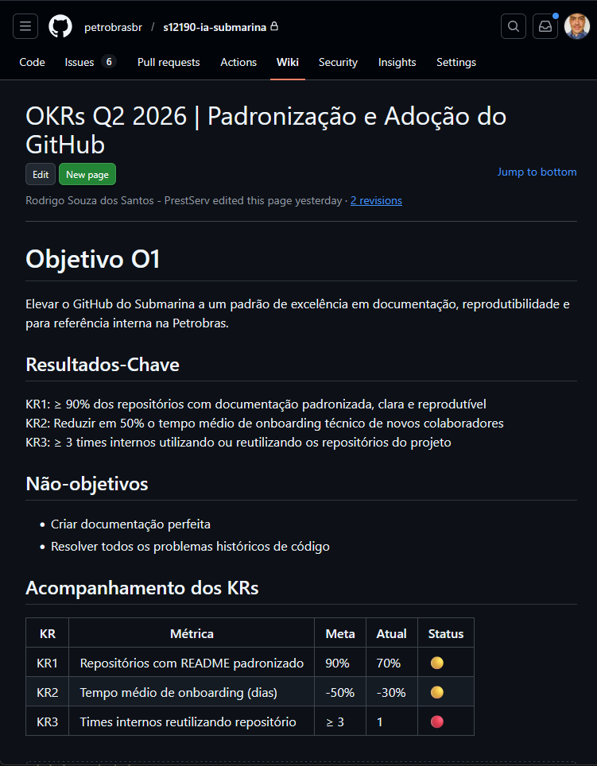

<div class="cover">
<div class="top-band"></div>
<div class="cover-content">
  <h1>Gestão Ágil de Projetos</h1>
  <h2>Usando GitHub Projects e OKR</h2>
  <div class="divider"></div>
  <p class="meta">
    Rodrigo Souza dos Santos<br>
    Compass.UOL · 2026
  </p>
</div>
</div>

<!-- Slide -->



---

##

::: {.standard-slide}
::: {.left-bar}
:::
::: {.content-area}

<h2>OKR, Scrum e Kanban</h2>

| Abordagem | Papel no projeto |
|---------|-----------------|
| [OKR]{.fragment .fade-in fragment-index=1 style="color:#008453"} | [Define prioridades e mede impacto]{.fragment .fade-in fragment-index=1 style="color:#fdb913"} |
| [Scrum]{.fragment .fade-in fragment-index=2 style="color:#008453"} | [Organiza entregas em ciclos]{.fragment .fade-in fragment-index=2 style="color:#fdb913"} |
| [Kanban]{.fragment .fade-in fragment-index=3 style="color:#008453"} | [Gerencia fluxo contínuo]{.fragment .fade-in fragment-index=3 style="color:#fdb913"} |


<div style="justify-items:center;margin-top:1.5em;font-size:1.7em;">

[<i class="fa-brands fa-github fade-in"></i> Visualiza e operacionaliza]{.fragment .fade-in}

</div>


:::
:::

---

##

::: {.standard-slide}
::: {.left-bar}
:::
::: {.content-area}

<h2>OKR, Scrum e Kanban</h2>

### Visão em camadas
<br>

::: {style="font-size:1.7em;"}
```
OKR       → Define o que importa
Scrum     → Executa com cadência
Kanban    → Executa com fluxo contínuo
GitHub    → Ferramenta de suporte
```
:::


:::
:::

<!-- Slide -->



<!-- Slide -->

# 

::: {.standard-slide}
::: {.left-bar}
:::
::: {.content-area}

<h2><i class="fa-brands fa-github"></i> OKR</h2>


::: {style="height: 500px;overflow-y: scroll;"}
{fig-align="center"}
:::

:::
:::

<!-- Slide -->

#

::: {.standard-slide}
::: {.left-bar}
:::
::: {.content-area}

<h2><i class="fa-brands fa-github"></i> GitHub Projects</h2>

[Preview](https://github.com/petrobrasbr){preview-link="true"}

:::
:::

---
 
##
 
<div class="standard-slide">
 
<div class="left-bar"></div>
 
<div class="content-area">
  <h2>Section Title</h2>
  <p>Content goes here.</p>
::: box

Consider a field experiment in agriculture where <span class="fragment highlight-red" fragment-index=2>plot</span> are laid in out as <span class="fragment highlight-red" fragment-index=1>6 rows by 8 columns</span> (each also called strip). There are <span class="fragment highlight-blue" fragment-index=3>4 modes of seedbed preparation and 3 crop varieties</span> that are of the interest to the researcher. The <span class="fragment highlight-blue" fragment-index=4>mode of seedbed preparation is assigned randomly to the whole columns</span>, and the <span class="fragment highlight-blue" fragment-index=5>crop variety is assigned randomly to the whole row</span>. This experimental design is called a **strip-plot design**.  

:::
</div>
 
</div>
 
---
 
##
 
```{mermaid}
kanban
  Proposed
  Backlog
    [Task 1]
    [Task 2]
  InProgress
    [Task 3]
  InReview
  Done
    [Task 4]
  Cancelled
  WontDo

```
