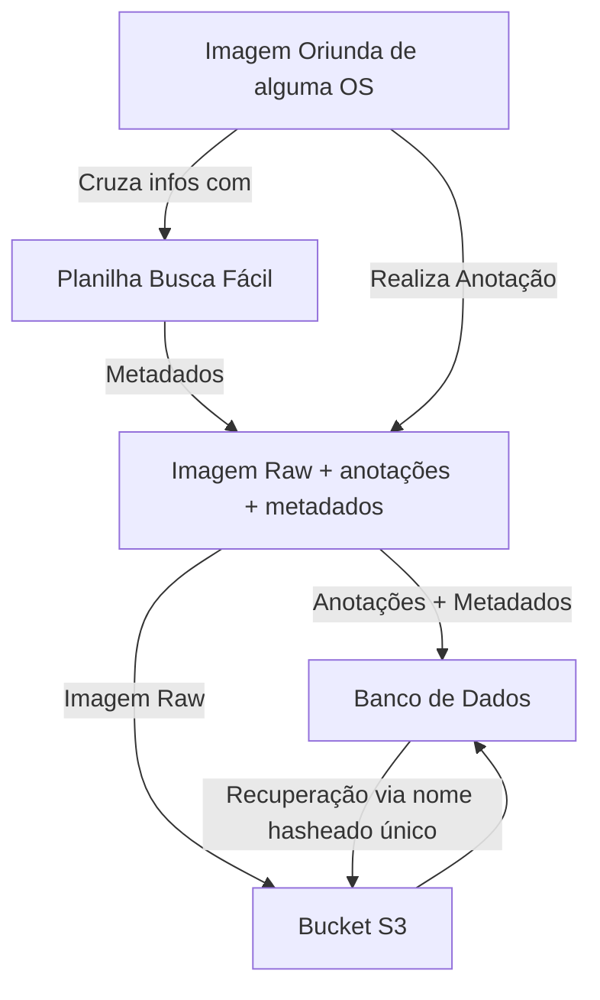
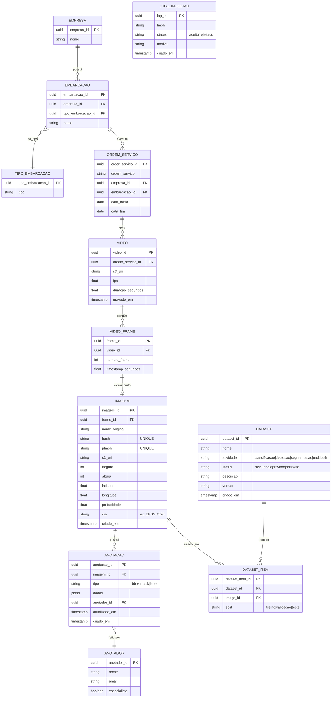
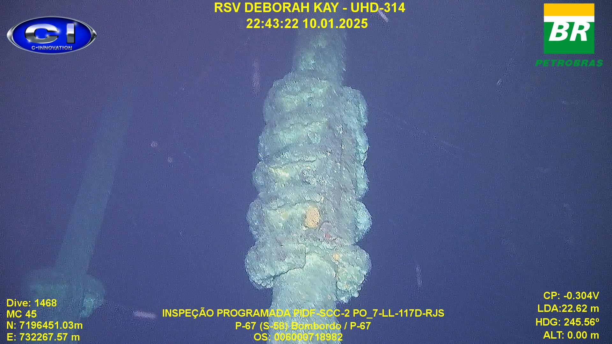
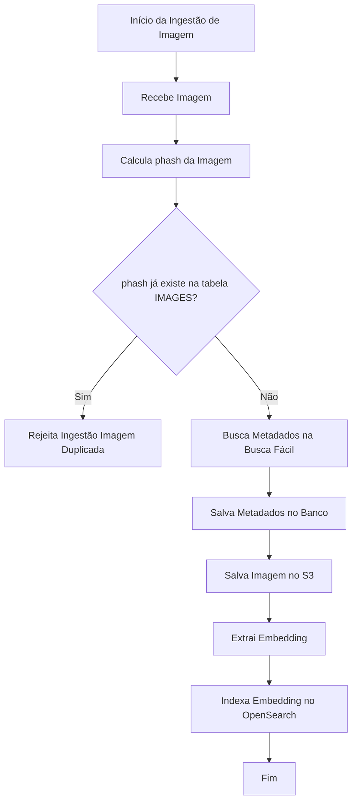
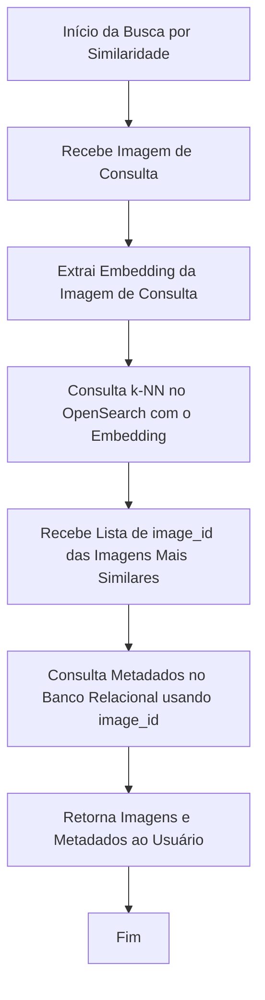
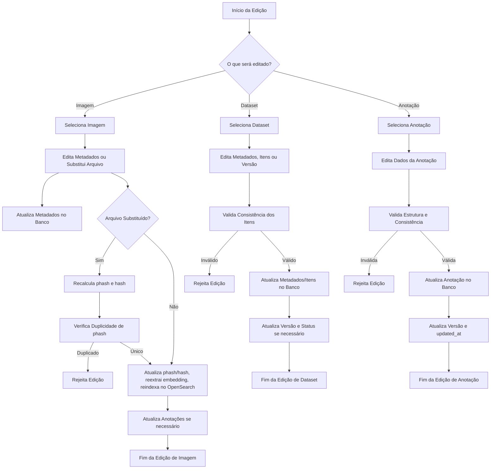

# Arquitetura para Gerenciamento de Datasets de Visão Computacional

## Histórico/Versionamento
- **Data**: de Março de 2026
- **Autor**: Breno Krohling (breno.krohling.prestserv@petrobras.com.br)
- **Descrição**: Versão inicial da documentação do projeto, de acordo com o proposto ma OKR 5 de 2026. Foram adicionados contexto geral do problema, requisitos, modelagem de dados e pontos de reflexão para próximos passos de acordo com feedback do Time Lider Técnico e PO.


## Contexto

Este documento descreve a arquitetura proposta para o gerenciamento de datasets de visão computacional, visando organizar imagens, vídeos, anotações e metadados de forma eficiente e escalável.  
O objetivo é permitir que todas as imagens estejam armazenadas em um bucket S3, enquanto os datasets são definidos dinamicamente via queries, a partir de imagens já classificadas ou anotadas.

A arquitetura foi desenhada para suportar múltiplas tarefas de visão computacional (classificação, detecção, segmentação, multitask), garantir rastreabilidade dos dados e facilitar a ingestão, consulta e versionamento dos datasets. Dessa forma, é possível manter rastreabilidaede dos dados utilizados em experimentos e garantir padrões de qualidade dos mesmos bem como histórico documentado.

## Principais Requisitos

- **Imagens sempre originadas de frames de vídeos.**
- **Anotações e classes vinculadas diretamente à imagem.**
- **Datasets compostos por imagens já anotadas/classificadas.**
- **Flexibilidade para múltiplos tipos de tarefas e anotações.**
- **Rastreabilidade de origem (empresa, embarcação, ordem de serviço, vídeo, frame).**
- **Versionamento e status dos datasets.**
- **Garantia de Não duplicidade**

**Pontos de Atenção**

Algumas informações previamente previstas para o modelo são gerenciadas por outras equipes, como por exemplo o cadastro de embarcações. É necessário debates posteriores em caso de escalar a solução para entender qual a melhor forma de lidar com esses dados, commo por exemplo apenas sincronizar e buscar os mesmos das fontes originais. Esse tipo de iniciativa envolveria o DataTeam da empresa bem como a interface com outras gerências;


## Integração entre S3, Banco Relacional e Banco Vetorial (OpenSearch)
O sistema de gerenciamento de datasets de visão computacional utiliza uma arquitetura combinando três componentes principais:

#### S3 (Object Storage)
- Função: Armazenamento físico dos arquivos de imagem.
- Vantagens: Escalabilidade, baixo custo, alta disponibilidade e integração fácil com pipelines de processamento.

#### Banco Relacional (PostgreSQL)
- Função: Armazenamento dos metadados estruturados, relacionamentos, controle de acesso, versionamento e integridade dos dados.
- Exemplos de dados: Informações sobre imagens (dimensões, localização, phash, hash, data de criação), datasets, anotações, usuários/anotadores, logs de ingestão.
- Vantagens: Integridade referencial, consultas complexas, transações ACID e rastreabilidade.

#### Banco Vetorial (OpenSearch)
- Função: Indexação e busca eficiente por similaridade entre imagens, utilizando embeddings vetoriais extraídos por modelos de IA.
- Exemplos de dados: Para cada imagem, armazena o embedding (vetor de floats), o image_id e metadados mínimos para integração.
- Vantagens: Busca por similaridade (k-NN), escalabilidade para grandes volumes, integração com pipelines de IA.

### Dinâmica de Interação
#### Ingestão de Imagem:
- O arquivo é salvo no S3.
- Os metadados são registrados no banco relacional.
- O embedding é extraído e indexado no OpenSearch, junto com o image_id.

#### Busca por Similaridade:
- O usuário envia uma imagem de consulta.
- O sistema extrai o embedding e consulta o OpenSearch.
- OpenSearch retorna os image_id das imagens mais similares.
- O sistema busca os metadados completos dessas imagens no banco relacional.
- Os arquivos de imagem são recuperados do S3 para exibição ou processamento.

#### Edição e Versionamento:
- Alterações em metadados ou anotações são feitas no banco relacional.
- Se o arquivo de imagem for substituído, o novo arquivo é salvo no S3, o embedding é reextraído e reindexado no OpenSearch.


#### Da origem dos dados
Na versão atual, os dados que irão compor o banco de dados serão originados a partir do cruzamento de informações entre a Ordem de Serviço (OS) que gerou as imagens com a planilha busca fácil, indexador de informações utilizadas da SUB, como descrito no fluxograma abaixo:




## Diagrama ER

A seguir temos o diagrama entidade relacioando utilizado para trackear e gerenciar as imagens e datasets do projeto, de acordo com o contexto e premissas apresentadas acima. A título de visualização. no arquivo [modelo_er_preenchido.md](modelo_er_preenchido.md) pode-se observar um exemplo real de como os dados estarão relacionados.



A seguir temos um pequeno exemplo de uma anotação para a imagem a seguir, a qual possui as classes coral-sol e colar-batente. Campos aos quais não haviam a informação exata, foram utilizados valores fictícios a título de exemplificação.



## EMPRESA
| empresa_id                            | nome      |
|---------------------------------------|-----------|
| 11111111-aaaa-aaaa-aaaa-111111111111  | C-Innovation |


## EMBARCACAO
| embarcacao_id                             | company_id                            | vessel_type_id                        | name         |
|-------------------------------------------|---------------------------------------|---------------------------------------|--------------|
| 22222222-bbbb-bbbb-bbbb-222222222222      | 11111111-aaaa-aaaa-aaaa-111111111111  | 33333333-cccc-cccc-cccc-333333333333  | Deborah Kay  |

## TIPO_EMBARCACAO
| tipo_embarcacao_id                        | tipo      |
|-------------------------------------------|-----------|
| 33333333-cccc-cccc-cccc-333333333333      | RSV       |

## ORDEM_SERVICO
| ordem_servico_id                      | ordem_servico | empresa_id                            | embarcacao_id                             | data_inicio  | data_fim    |
|---------------------------------------|---------------|---------------------------------------|-------------------------------------------|--------------|-------------|
| 44444444-dddd-dddd-dddd-444444444444  | 6000718982    | 11111111-aaaa-aaaa-aaaa-111111111111  | 22222222-bbbb-bbbb-bbbb-222222222222      | 2026-03-01   | 2026-03-02  |

## VIDEO
| video_id                              | ordem_servico_id                      | s3_uri                                   | fps  | duracao_segundos | gravado_em           |
|---------------------------------------|---------------------------------------|------------------------------------------|------|------------------|----------------------|
| 55555555-eeee-eeee-eeee-555555555555  | 44444444-dddd-dddd-dddd-444444444444  | s3://path/to/video                       | 30   | 1200             | 2025-01-10T22:43:22Z |
---
## VIDEO_FRAME
| frame_id                              | video_id                              | numero_frame | timestamp_segundos|
|---------------------------------------|---------------------------------------|--------------|-------------------|
| 66666666-ffff-ffff-ffff-666666666666  | 55555555-eeee-eeee-eeee-555555555555  | 100          | 3.33              |

---
## IMAGEM
| imagem_id                              | frame_id                              | hash      | phash   | s3_uri                                 | largura | comprimento | norte     | leste      | profundidade   | crs       | criado_em            |
|---------------------------------------|---------------------------------------|-----------|---------|----------------------------------------|-------|--------|-----------|-----------|-------|-----------|----------------------|
| 88888888-bbbb-bbbb-bbbb-888888888888  | 66666666-ffff-ffff-ffff-666666666666  | 1bacdfebacbd32babc432 | 1eabc3423baabef4  | s3://petrobras/images/img1.jpg         | 1920  | 1080   | 7196451  | 732267.57  | 0.0   | EPSG:1498 | 2026-03-01T10:00:03Z |

---
## ANOTADOR
| anotador_id                           | nome       | email                      | especialista |
|---------------------------------------|------------|----------------------------|---------------|
| aaaaaaaa-1111-1111-1111-aaaaaaaaaaaa  | Ana Silva  | ana.silva@petrobras.com    | true          |
---
## ANOTACAO
| annotacao_id                         | imagem_id                              | tipo   | dados                                                                                      | anotador_id                          | versao | criado_em            | atualizado_em            |
|---------------------------------------|---------------------------------------|--------|-------------------------------------------------------------------------------------------|---------------------------------------|---------|----------------------|-----------------------|
| cccccccc-3333-3333-3333-cccccccccccc  | 88888888-bbbb-bbbb-bbbb-888888888888  | bbox   | {"type":"label","label":["coral-sol", "colar-batente"]}                                  | aaaaaaaa-1111-1111-1111-aaaaaaaaaaaa  | 1       | 2026-03-01T11:00:00Z | 2026-03-01T11:00:00Z  |
---
## DATASET
| dataset_id                            | nome           | tarefa      | status  | descricao           | versao | criado_em            | atualizado_em            |
|---------------------------------------|----------------|-------------|---------|-----------------------|---------|----------------------|-----------------------|
| eeeeeeee-5555-5555-5555-eeeeeeeeeeee  | Detecção coral sol 2026      | detccao | rascunho  | Dataset de detecção   | 1.0     | 2026-03-01T12:00:00Z | 2026-03-01T12:00:00Z  |
---
## DATASET_ITEM
| dataset_item_id                       | dataset_id                            | imagem_id                              | split   |
|---------------------------------------|---------------------------------------|----------------------------------------|-------- |
| ffffffff-6666-6666-6666-ffffffffffff  | eeeeeeee-5555-5555-5555-eeeeeeeeeeee  | 88888888-bbbb-bbbb-bbbb-888888888888   | treino  |

---

## Padrão de Anotações (`ANOTACAO.dados`)

O campo `dados` da tabela `ANOTACAO` é do tipo JSON e deve seguir um padrão mínimo obrigatório para cada tipo de task, conforme descrito abaixo:

### Padrão mínimo obrigatório por task

| Tarefa           | Campos obrigatórios em `dados`                                                                |
|----------------|----------------------------------------------------------------------------------------------|
| classificacao  | `tipo`, `rotulo`                                                                              |
| deteccao       | `tipo`, `rotulo`, `bbox`                                                                      |
| segmentacao    | `tipo`, `rotulo`, ou `poligono`                                                     |
| multitask      | `tipo`, e pelo menos um dos blocos: `classificacao`, `deteccao`, `segmentacao`, etc.      |

---

### Exemplos de estrutura do campo `dados`

A seguir exemplificamos padrões de anotação para as imagens. Vale ressaltar que cada imagem pode conter uma anotação para cada tipo de tarefa. Se para um tarefa de classificação, a mesma imagem tiver mais de um rótulo, todos os rótulso deve constar em uma lista no json de dados a ser utilizado como campo da tabela de anotações.

#### **Classificação**
```json
{
  "tipo": "rotulo",
  "rotulo": "navio"
}
```

#### **Detecção**
```json
{
  "tipo": "bbox",
  "rotulo": "navio",
  "bbox": [100, 200, 300, 400]
}
```

#### **Detecção**
```json
{
  "tipo": "mask",
  "rotulo": "navio",
  "poligono": [[10, 20], [30, 40], [50, 60]]
}
```

## Documentação dos Campos ENUM
#### DATASETS
- **task**
  - `classificacao`: Classificação de imagens.
  - `deteccap`: Detecção de objetos (bounding boxes).
  - `segmentacao`: Segmentação de objetos (máscaras ou polígonos).
  - `multitask`: Combinação de múltiplas tarefas.
- **status**
  - `rascunho`: Dataset em rascunho, ainda não aprovado.
  - `aprovado`: Dataset aprovado para uso.
  - `obsoleto`: Dataset obsoleto, não deve ser mais utilizado.
---
#### DATASET_ITEMS
- **split**
  - `treino`: Imagens destinadas ao treinamento.
  - `validacao`: Imagens destinadas à validação.
  - `teste`: Imagens destinadas ao teste.
---
#### ANNOTATIONS
- **type**
  - `bbox`: Anotação de bounding box (detecção).
  - `mask`: Anotação de máscara (segmentação).
  - `rotulo`: Anotação de classe (classificação).
  - `poligono`: Anotação de polígono (segmentação).
  - `multitask`: Anotação composta (mais de uma task).
---
#### INGESTION_LOGS
- **status**
  - `aceito`: Ingestão aceita.
  - `rejeitado`: Ingestão rejeitada.
---
> **Observação:**  
> Sempre que um novo valor for adicionado a um campo ENUM, atualize esta documentação e, se necessário, ajuste as validações no backend.

## Busca por Similaridade de Imagens

A busca por similaridade de imagens é uma funcionalidade essencial em sistemas de visão computacional modernos. Ela permite encontrar, em um grande acervo, imagens que são visualmente ou semanticamente parecidas com uma imagem de referência (consulta).

Diferente de buscas tradicionais por texto ou metadados, a busca por similaridade utiliza embeddings, representações numéricas extraídas por modelos de inteligência artificial, para comparar o conteúdo visual das imagens.

No contexto deste sistema, a busca por similaridade é utilizada para:
- Deduplicação: Identificar imagens muito semelhantes (imagens idênticas são detectads através de algoritmos de phashing antes da inserção da imagem no banco relacional).
- Recomendação: Sugerir imagens relacionadas para análise ou anotação.
- Navegação Semântica: Permitir que usuários encontrem rapidamente imagens com padrões visuais semelhantes, mesmo que não estejam anotadas com as mesmas palavras-chave.
- Apoio à Anotação: Facilitar o trabalho de anotadores ao sugerir exemplos similares.

A implementação utiliza o OpenSearch com suporte a busca vetorial (k-NN), onde cada imagem tem seu embedding indexado. Quando uma busca é realizada, o sistema extrai o embedding da imagem de consulta e retorna as imagens mais próximas no espaço vetorial, garantindo alta performance e precisão mesmo em grandes volumes de dados.

### Como funciona
- Cada imagem tem um embedding extraído por modelo de visão computacional.
- Os embeddings são indexados em um índice k-NN do OpenSearch.
- A busca por similaridade retorna as imagens mais próximas no espaço vetorial.
### Pipeline
1. **Ingestão:** Imagem salva em S3, metadados no banco relacional, embedding extraído e indexado no OpenSearch.
2. **Busca:** Embedding da imagem de consulta extraído, busca k-NN no OpenSearch, metadados recuperados pelo `image_id`.
## Principais Pipelines
#### Injestão de novas imagens
---


#### Busca de imagens via embedding

#### Edição de imagens, anotações e datasets


## Items a serem implementados na OKR 5
- Modelagem ER do banco de dados
- Banco de dados local a partir do modelo ER
- Injestão de dataset de coral sol anotado por especialista no banco local

## Implementação parcial
- Pipeline de injestão (será feito através de script e não ferramenta "visual")

## Items que não serão feitos na OKR5
- Implemetação de banco Vetorial
- Pipeline de Busca Vetorial
- Pipelines de Edição

## Pontos de discussões futuras
- Planejamento e colaboração externa para expandir/refatorar o banco de dados