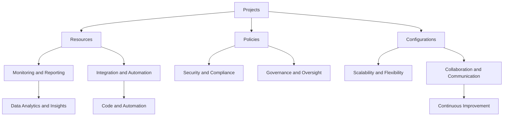

# Subsea Architecture

The Subsea architecture is designed to provide a flexible and scalable framework
for managing projects and initiatives across different teams and departments.
The architecture is based on the following key components:

  1. **Projects**: Projects are the core component of the Subsea architecture.
     They represent specific initiatives or efforts that teams are working on.
     Projects can be associated with specific resources, policies, and
     configurations, allowing for better management and organization of work.
    - Projects can be allocated based on specific needs and requirements,
      allowing for better performance and reduced costs. This can help teams to
      optimize their use of resources and to ensure that they are using
      resources efficiently and effectively.
    - Projects can also be shared across different teams, allowing for better
      collaboration and communication among teams. This can help to improve
      productivity and efficiency, as teams can easily access the resources they
      need to complete their work.

  2. **Resources**: Resources are the various assets, tools, and services that
     teams use to complete their work. They can include things like computing
     resources, storage, software tools, and other assets that are necessary for
     completing projects and initiatives. Resources can be associated with
     specific projects, allowing for better management and organization of work.
    - Resources can be allocated based on specific needs and requirements,
      allowing for better performance and reduced costs. This can help teams to
      optimize their use of resources and to ensure that they are using
      resources efficiently and effectively.
    - Resources can also be shared across different projects, allowing for
      better collaboration and communication among teams. This can help to
      improve productivity and efficiency, as teams can easily access the
      resources they need to complete their work.
    - Resources can also be associated with specific policies and
      configurations, allowing for better management of resources and ensuring
      that teams are following best practices and guidelines. This can help to
      improve the overall quality of work and to ensure that teams are working
      efficiently and effectively.

  3. **Policies**: Policies are the rules, guidelines, and best practices that
     govern how teams manage and use resources within project. They can include
     things like security policies, access control policies, resource allocation
     policies, and other guidelines that help to ensure that teams are working
     efficiently and effectively.
    - Policies can be used to ensure that teams are following best practices and
      guidelines, which can help to improve the overall quality of work and to
      ensure that teams are working efficiently and effectively. This can help
      to reduce errors, improve security, and ensure that teams are using
      resources in a responsible and effective manner.
    - Policies can also be used to manage access to resources, ensuring that
      only authorized users have access to sensitive information and resources.
      This can help to improve security and to protect sensitive information
      from unauthorized access.
    - Policies can also be used to manage resource allocation, ensuring that
      teams are using resources efficiently and effectively. This can help to
      reduce costs and to optimize the use of resources across different
      projects and initiatives.

  4. **Configurations**: Configurations are the specific settings, parameters,
     and options that teams use to manage and control their resources within a
     protect. They can include things like resource configurations, policy
     configurations, and other settings that help to ensure that teams are
     working efficiently and effectively.
    - Configurations can be used to optimize the use of resources, ensuring that
      teams are using resources in the most efficient and effective manner
      possible.  This can help to reduce costs and to improve performance across
      different projects and initiatives.
    - Configurations can also be used to manage policies, ensuring that teams
      are following best practices and guidelines, which can help to improve the
      overall quality of work and to ensure that teams are working efficiently
      and effectively. This can help to reduce errors, improve security, and
      ensure that teams are using resources in a responsible and effective
      manner.
    - Configurations can also be used to manage access to resources, ensuring
      that only authorized users have access to sensitive information and
      resources. This can help to improve security and to protect sensitive
      information from unauthorized access.

  5. **Monitoring and Reporting**: The Subsea architecture also includes
     monitoring and reporting capabilities, allowing teams to track the
     performance and usage of resources, as well as to generate reports on
     project progress and resource utilization. This can help teams to identify
     areas for improvement and to make informed decisions about resource
     allocation and project management.

  6. **Integration and Automation**: The Subsea architecture is designed to
     integrate with various tools and platforms, allowing for automation of
     workflows and processes. This can help to improve efficiency and to reduce
     manual effort, allowing teams to focus on more strategic and value-added
     activities. The architecture can also be extended and customized to fit the
     specific needs of different teams and projects, allowing for greater
     flexibility and adaptability.  Overall, the Subsea architecture provides a
     comprehensive framework for managing projects and resources, ensuring that
     teams are working efficiently and effectively, and enabling better
     collaboration and communication across different teams and departments.

  7. **Security and Compliance**: The Subsea architecture also includes security
     and compliance features, allowing teams to ensure that their projects and
     resources are secure and compliant with relevant regulations and standards.
     This can help to protect sensitive information and to ensure that teams are
     following best practices for security and compliance. The architecture can
     also be extended to include additional security and compliance features as
     needed, allowing teams to customize their security and compliance
     strategies based on their specific needs and requirements. Overall, the
     Subsea architecture provides a comprehensive framework for managing
     projects and resources while ensuring that security and compliance are
     prioritized. This can help teams to mitigate risks and to ensure that they
     are operating in a secure and compliant manner.

  8. **Scalability and Flexibility**: The Subsea architecture is designed to be
     scalable and flexible, allowing teams to manage projects and resources of
     varying sizes and complexities. This can help teams to adapt to changing
     needs and requirements, and to ensure that they are able to manage their
     projects and resources effectively as they grow and evolve. The
     architecture can also be extended and customized to fit the specific needs
     of different teams and projects, allowing for greater flexibility and
     adaptability.  Overall, the Subsea architecture provides a comprehensive
     framework for managing projects and resources while ensuring that teams are
     able to scale and adapt as needed. This can help teams to stay agile and
     responsive to changing needs and requirements, and to ensure that they are
     able to manage their projects and resources effectively over time.

  9. **Collaboration and Communication**: The Subsea architecture also
     emphasizes collaboration and communication among teams, allowing for better
     coordination and alignment across different projects and initiatives. This
     can help to improve productivity and efficiency, as teams can easily share
     information and resources, and can work together to achieve common goals.
     The architecture can also be extended to include additional collaboration
     and communication features as needed, allowing teams to customize their
     collaboration and communication strategies based on their specific needs
     and requirements. Overall, the Subsea architecture provides a comprehensive
     framework for managing projects and resources while prioritizing
     collaboration and communication among teams. This can help teams to work
     together more effectively and to achieve better outcomes across different
     projects and initiatives.

  10. **Continuous Improvement**: The Subsea architecture also includes features
      for continuous improvement, allowing teams to identify areas for
      improvement and to implement changes to optimize their processes and
      workflows.  This can help teams to stay agile and responsive to changing
      needs and requirements, and to ensure that they are continuously improving
      their performance and outcomes over time. The architecture can also be
      extended to include additional features for continuous improvement as
      needed, allowing teams to customize their continuous improvement
      strategies based on their specific needs and requirements. Overall, the
      Subsea architecture provides a comprehensive framework for managing
      projects and resources while prioritizing continuous improvement, helping
      teams to stay competitive and successful in a rapidly changing
      environment.

  11. **Governance and Oversight**: The Subsea architecture also includes
      features for governance and oversight, allowing teams to ensure that their
      projects and resources are being managed in accordance with organizational
      policies and standards. This can help to ensure that teams are following
      best practices and guidelines, and that they are operating in a
      responsible and effective manner. The architecture can also be extended to
      include additional features for governance and oversight as needed,
      allowing teams to customize their governance and oversight strategies
      based on their specific needs and requirements. Overall, the Subsea
      architecture provides a comprehensive framework for managing projects and
      resources while prioritizing governance and oversight, helping teams to
      ensure that they are operating in a responsible and effective manner, and
      to mitigate risks associated with project management and resource
      allocation.

  12. **Data Analytics and Insights**: The Subsea architecture also includes
      features for data analytics and insights, allowing teams to analyze their
      project and resource data to gain insights into performance, trends, and
      opportunities for improvement. This can help teams to make informed
      decisions about project management and resource allocation, and to
      identify areas for optimization and growth. The architecture can also be
      extended to include additional features for data analytics and insights as
      needed, allowing teams to customize their data analytics strategies based
      on their specific needs and requirements. Overall, the Subsea architecture
      provides a comprehensive framework for managing projects and resources
      while prioritizing data analytics and insights, helping teams to make
      informed decisions and to optimize their performance over time.

  13. **Code and Automation**: The Subsea architecture also includes features
      for code and automation, allowing teams to automate their workflows and
      processes to improve efficiency and reduce manual effort.
      This can help teams to focus on more strategic and value-added activities,
      and to ensure that they are able to manage their projects and resources
      effectively as they grow and evolve.
      The architecture can also be extended to include additional features for
      code and automation as needed, allowing teams to customize their
      automation strategies based on their specific needs and requirements.
      Overall, the Subsea architecture provides a comprehensive framework for
      managing projects and resources while prioritizing code and automation,
      helping teams to stay agile and responsive to changing needs and
      requirements, and to ensure that they are able to manage their projects
      and resources effectively over time.





```mermaid
C4Context
    title Subsea Architecture

    Enterprise_Boundary(b0, "Organization") {
        System(s1, "Subsea", "A comprehensive framework for managing projects
and resources")
        Database(db1, "Project and Resource Data", "Stores information about
projects, resources, policies, and configurations")
        Storage(st1, "Monitoring and Reporting Data", "Stores images and videos
related to subsea studies and inspections")
        Stoorage(st2, "Models and Simulations", "Stores models and simulations
related to subsea studies and inspections")
    }

    System_Ext(s2, "External Tools", "Various tools and platforms that integrate with Subsea")

    Rel(s1, s2, "Integrates with")

    Rel(s1, db1, "Reads and writes data to")
    Rel(s1, st1, "Stores monitoring and reporting data in")
    Rel(s1, st2, "Stores models and simulations in")
```

